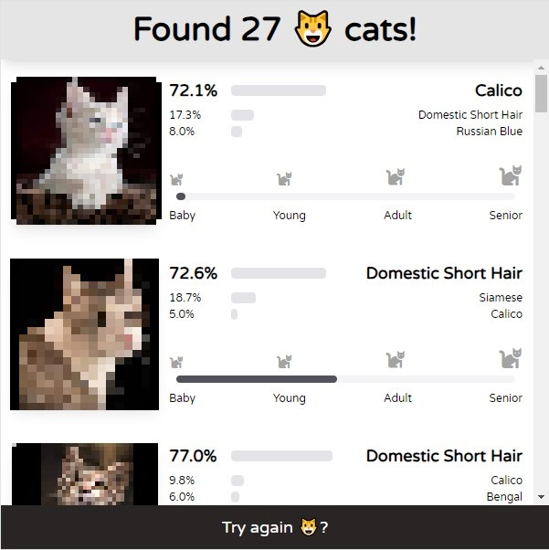
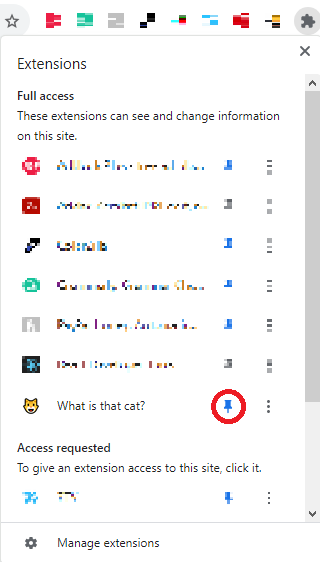
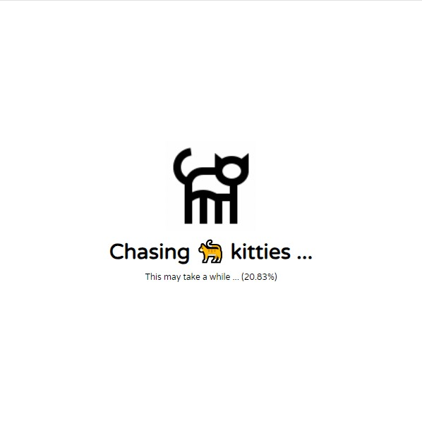
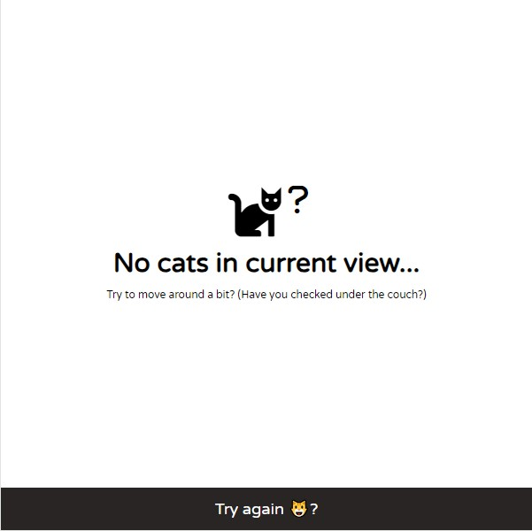
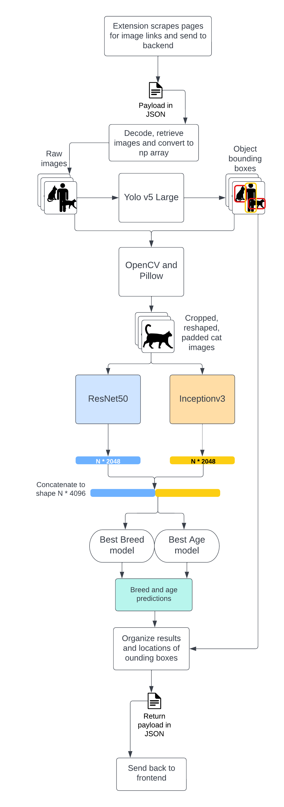

# 🐱CatVision

CatVision is a proof-of-concept Chrome Extension that implements Machine Learning models to predict cat breed and age information using cat images on websites. 

## Quick Start

To deploy this project, you will need to:
  1. Deploy the backend Python Flask server that houses the image processing pipeline
  2. Load the Extension into Chrome. 

The backend can be deployed locally with [Docker](https://www.docker.com/products/docker-desktop). With Docker engine running, run the following Docker CLI commands in the project directory:

  - `docker build -t cat-vision-api-img .` to build the container image
  - `docker run -dit -p 5000:5000 --name cat-vision-api cat-vision-api-img` to run the container

**It could take a while for the container to become ready, check the Logs for the Docker container for status information. The extension will not work if the backend is not ready!**

To load the Extension into Chrome, refer to the instructions from [Chrome Developer Documentation](https://developer.chrome.com/docs/extensions/mv3/getstarted/development-basics/#load-unpacked), use `/web/build` as the extension directory. 

If you have any web pages open **before** the extension is added, you will need to reload those pages for the extension to work.

## Manual Deploy

Though deploying with Docker is recommended, the Python backend can also be deployed manually. 

1. Use Python 3.8 or newer
2. Install dependencies `pip install flask numpy pandas torch torchvision opencv-python-headless pillow`
3. Run the Python Flask server with `flask --app api run --host=0.0.0.0`

## Modification 

Source code for the extension interface is located under `/web/src`. Setup [npm](https://www.npmjs.com/), run `npm install` to install dependencies, run `npm run build` to build for production, run `npm run dev` to build for development. The built extension is located under `/web/build`. Refer to [Chrome Developer Documentation](https://developer.chrome.com/docs/extensions/mv3/getstarted/development-basics/) for more details.

Source code for the Python Flask server is under `/backend`. Remember to rebuild the container image if you are using Docker. 

## Extension Interface

Click on the Extension button to open the extension interface. If you do not see the extension button, make sure to pin the extension.

After the Extension interface shows up, the extension will scrape the currently opened tab to find all images visible in the current view. These images will be sent to the backend server for processing in batches of 5. 

When results from the backend are ready, the extension will display the cat breed and age predictions for each cat found among the images. It can recognize individual cats from complex images with many different entities. The following cat images are blurred for copyright reasons.

If no cats can be recognized from images or no images exist in the current view, the following view will be displayed.

## Image Processing Pipeline

## Disclosure

This project uses [YOLOv5](https://github.com/ultralytics/yolov5), [Inception v3](https://pytorch.org/hub/pytorch_vision_inception_v3/), and [ResNet50](https://pytorch.org/vision/main/models/generated/torchvision.models.resnet50.html) machine learning models as parts of the image processing pipeline. 

## License 

This project is licensed under AGPL-3.0 License - see the [LICENSE](LICENSE) file for details.
